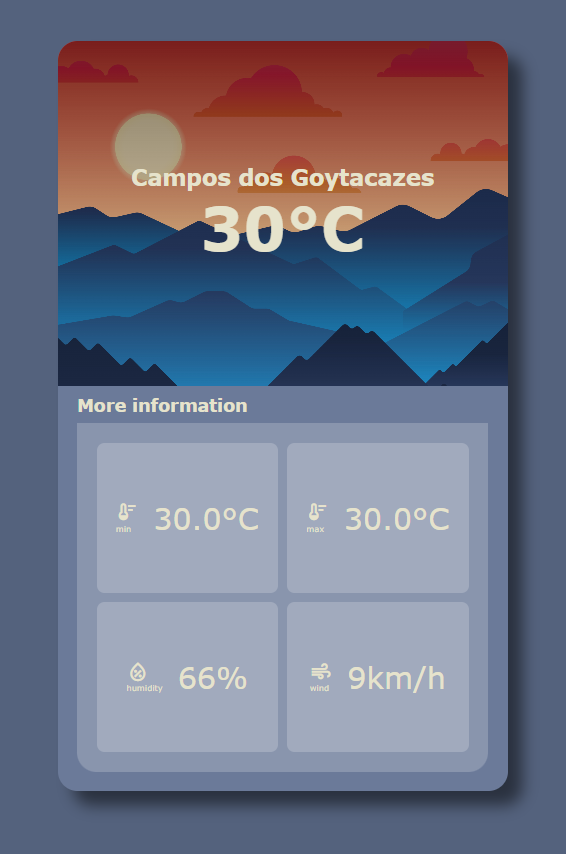

# WeatherApp

A dashboard that show weather informations about city as temperature, humidity and wind speed. Using OnInit method from AppComponent the service of OpenWeather is called and response data is send to dashboard.

This project was made based on this tutorial from [Sameer Saini](https://www.youtube.com/@SameerSaini).

[Angular Project Tutorial - Build an Angular Weather App From Scratch - Open Weather API Tutorial](https://www.youtube.com/watch?v=psZXU8PTAS8)
